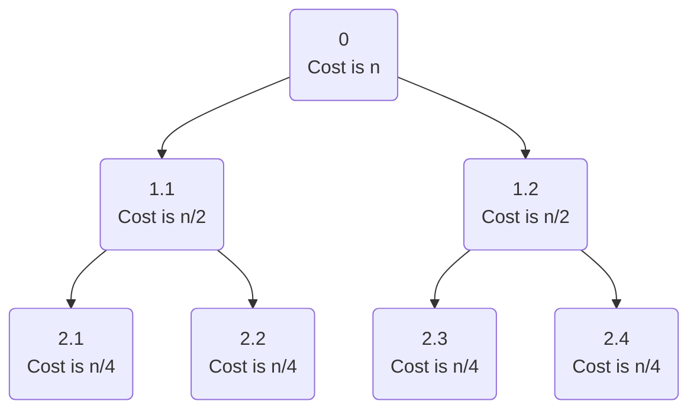
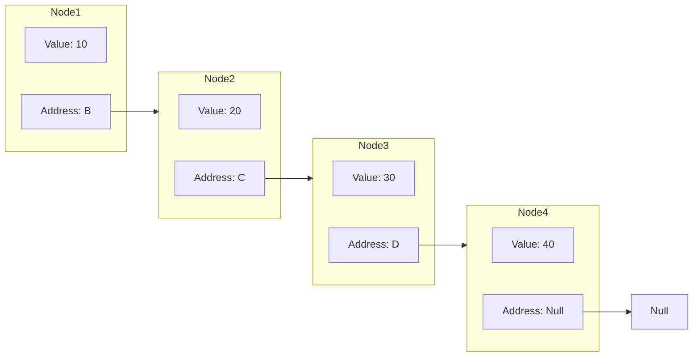

# Algorithm

## Definition

**=>** An Algorithm is any well-defined computational procedure that takes some value or set of values as Input and produces a set of values or some value as output.

In other words, or in a more formal manner, we can define an Algorithm as:

**=>** An Algorithm is a finite set of instructions that, if followed, accomplishes a particular task. In addition, all algorithms should satisfy the following criteria:
- **INPUT** : Zero or more quantities are externally supplied.
- **OUTPUT** : At least one quantity is produced.
- **DEFINITENESS** : Each instruction is clear and unambiguous.
- **FINITENESS** : If we trace out the instructions of an algorithm, then for all cases, the algorithm terminates after a finite number of steps.
- **EFFECTIVENESS** : Every instruction must very basic so that it can be carried out, in principle, by a person using only pencil & paper.

## Representation

An algorithm can be described in *three* ways:
- Natural language
- Flowchart
- Pseudo-Code

## Complexities

Complexity of an algorithm is basically an indicator value that shows how efficient the algorithm is. It is typically measured in terms of *time* and *space*.

### Space Complexity

This tells us the amount of memory the algorithm needs for it to function properly. The space required by an algorithm can be of two types:
- A *predetermined amount* of space the algorithm will need every time it is used, regardless of how much input it takes,
- A *Variable amount* of space that depends on how much input the algorithm works with.

So to standardize Space Complexity into one statement, we can say:
$$S(P) = C + S(I)$$
where:
- $S(P)$ -> Space complexity of the algorithm
- C -> Constant space taken
- $S(I)$ -> Variable space taken, depending on instance $I$  of the input.

**Example 1:**
Sum of two numbers: `SUM(A, B)`

```
1  Start
2
3  C <- A + B
4
5  STOP
```

Here, as the input itself is constant, there is no variable space in this algorithm. Thus:
- `C` takes *4 bytes*
- Input takes *4 + 4 = 8 bytes*
And it is constant every time we run this algorithm.

Thus Space complexity becomes:

$$
S(P) = S(12) = 1
$$

As this space complexity is constant, we can also denote the upper bound (Big-O) with it as $O(1)$.

**Example 2:**
Sum of `n` numbers: `SUM(A[], n)`

```
1  Start
2
3  SUM <- 0
4  FOR i = 1 to n
5    SUM <- SUM + A[i]
6  END FOR
7
8  STOP
```

Here:
- `SUM` takes *4 bytes*
- `i` takes *4 bytes*
- `n` takes *4 bytes*
- `A[]` takes *n bytes*

Therefore:
- $C = S(12) = 1$
- $S(I) = n$

$$
S(P) = 1 + n \approx n
$$

As 1 is significantly smaller than n, we ignore it in complexities.
We can denote its upper bound as $O(n)$

### Time Complexity

Just like how space complexity tells us how much space an algorithm needs, Time Complexity tells us how much time it will need to produce the required output. It is also represented as numerical functions, where it is assumed that each step will take a constant amount of time.

**Example:**
Return TRUE if a number `x` exists in an array `A[n]`: `isPresent(A[], n, x)`

```
1  Start
2
3  FOR i = 1 to n
4    IF A[i] equal to x
5      RETURN TRUE
6
7  RETURN FALSE
8
9  STOP
```

So the upper bound of the algorithm is, when `x` is not present in the input array.

Thus the steps in this algorithm are:
- Declaration of `i`
- Loop (`n` times):
	- Comparing `i` to `n`
	- `IF` Statement
	- `RETURN` Statement, but in worst case it won't get executed
- `RETURN` statement

So time taken in units is $1 + n * (1) + 1 \approx n$

Therefore we can write it as $O(n)$ (upper bound).

## Asymptotic Analysis

It refers to the analysis of an algorithm's performance using mathematical calculations. Using Asymptotic analysis we can get definite answers for its best, average and worst case performances.

Asymptotic analysis depends on the input of the algorithm. If there is no input, it is assumed that the algorithm's complexities are constant.

Now the cases in which an algorithm's performance falls under are **Best Case**, **Average Case** and **Worst Case**, and are denoted by the following notations:

| Case    | Notation |
| ------- | -------- |
| Best    | $\Theta$ |
| Average | $\Omega$ |
| Worst   | O        |

### Big Oh Notation: O

Used to express the *upper bound* of an algorithm. In other words, it expresses the longest amount of time the algorithm can possibly take.

It is expressed as:

$$
f(n) \leq c \times g(n)
$$

where:
- $n$ is input size
- $f(n)$ is actual time complexity of the algorithm
- $g(n)$ is a known complexity, with which we are comparing $f(n)$
- $c$ is a constant
- $n \geq n_0$, where $n_0$ is a certain amount of input (threshold)

So basically the $n$ we take is the upper bound complexity, which is always greater than $f(n)$.

**Example:**
Consider the function $f(n) = 3n^2 + 2n + 1$

Let's take:
- $g(n) = n^2$
- $c = 6$

Therefore we get:

$$
f(n) \leq 6 \times n^2
$$
where:
- $n_0 = 1$

So for every $n \geq 1$, this equation holds.

Therefore we can say: $f(n)$ is $O(n^2)$.

### Big Omega Notation: $\Omega$

Used to express the *lower bound* of an algorithm. In other words, it expresses the least amount of time the algorithm can possibly take.

It is expressed as:

$$
c \times g(n) \leq f(n)
$$

where:
- $n$ is input size
- $f(n)$ is actual time complexity of the algorithm
- $g(n)$ is a known complexity, with which we are comparing $f(n)$
- $c$ is a constant
- $n \geq n_0$, where $n_0$ is a certain amount of input (threshold)

So basically the $n$ we take is the lower bound complexity, which is always less than $f(n)$.

**Example:**
Consider the same function $f(n) = 3n^2 + 2n + 1$

Let's take:
- $g(n) = n^2$
- $c = 3$

Therefore we get:

$$
3 \times n^2 \leq f(n)
$$

where:
- $n_0 = 1$

So for every $n \geq 1$, this equation holds.

Therefore we can say: $f(n)$ is $\Omega(n^2)$.

> **Note**: We could have also taken $g(n) = n$, as $n$ is always less than $n^2$. But we are supposed to take the tight bounds for asymptotic notations. As we get a tighter bound with $n^2$, we go with it.

### Big Theta Notation: $\Theta$

It is a way to express kind-of the middle bound, or the average of the runtime of an algorithm.

It is expressed as:

$$
c_1 \times g(n_1) \leq f(n) \leq c_2 \times g(n_2)
$$

where:
- $n$ is input size
- $f(n)$ is actual time complexity of the algorithm
- $g(n_1)$ and $g(n_2)$ are known complexities, with which we are comparing $f(n)$
- $c_1$ and $c_2$ are constants
- $n \geq n_0$, where $n_0$ is a certain amount of input (threshold)

**Example:**
Consider the same function $f(n) = 3n^2 + 2n + 1$

Let's take:
- $c_1 = 3$ and $g(n_1) = n^2$
- $c_2 = 6$ and $g(n_2) = n^2$

Therefore we get:

$$
3 \times n^2 \leq f(n) \leq 6 \times n^2
$$

where:
- $n_0 = 1$

So for every $n \geq 1$, this equation holds.

Therefore we can say: $f(n)$ is $\Theta(n^2)$.

# Recurrence Relation

An equation or inequality, that describes its value in smaller chunks of itself, with some initial conditions. We can understand it better with an *Example:*

Let's take the example of **Fibonacci sequence**. Remember the sequence where a value is the sum of the two immediate previous elements?

So we know, Fibonacci sequence starts with 0 and 1. So:
- $n_0 = 0$
- $n_1 = 1$

Now, if an element is said to be $F(n)$, then:

$$
F(n) = F(n - 1) + F(n - 2)
$$

where $F(0) = 0, F(1) = 1$

So we can see, this relation describes its value in smaller parts, or we can say previous values for this example.

## Recurrence Relations in Algorithms

When it comes to Asymptotic analysis of *Recursive algorithms*, our simple step-counting methods fail. Moreover, that method had varying values of constants and threshold input spaces, and we needed a more definitive approach. 

When we use recurrence relations to analyse recursive algorithms, we can get definite results.

There are four methods of solving Recurrence Relations:
- Substitution Method
- Iteration Method
- Recursion Tree Method
- Master Method

Let's look into each of them.

### Substitution Method

This is a straightforward method of solving recurrences.

- Guess the solution
- Use mathematical Induction to show the guess is correct.

**Example:** 
Let's solve the recurrence relation $T(n) = T(n - 1) + n$, $n > 1$

So, we have $T(n) = 1$ when $n = 1$.

So for the next terms:
- $T(1) = 1$
- $T(2) = T(1) + 2 = 1 + 2 = 3$
- $T(3) = T(2) + 3 = T(1) + 2 + 3 = 1 + 2 + 3 = 6$
- $T(4) = 1 + 2 + 3 + 4 = 10$

So the pattern is the sum of n natural numbers: $\frac{(n \times (n + 1))}{2}$. Hence the time complexity is $O(n^2)$.

Now let's prove the guess is correct using Mathematical Induction:

- For $T(1)$: $\frac{1 \times (1 + 1)}{2} = 1$; which matches the definition of recurrence $T(1) = 1$

- Let's assume $T(N - 1)$ is true.
  Then $T(N - 1) = \frac{((N - 1) \times (N - 1 + 1))}{2}$ is true.
  => $T(N - 1) = \frac{N \times (N - 1)}{2}$

- Then for $T(N):$
  $T(N) = T(N - 1) + N$
  $T(N) = \frac{N \times (N - 1)}{2} + N$
  $T(N) = \frac{N^2 - N + 2N}{2}$
  $T(N) = \frac{N \times (N + 1)}{2}$

  And according to our guess: $T(N) = \frac{N \times (N + 1)}{2}$

Therefore we can conclude that our guess was correct, and we proved it using Mathematical Induction.

### Iterative Method

This method unfolds the recurrence relation step-by-step.

**Example:** 
Let's solve the recurrence relation $T(n) = T(\frac{n}{2}) + n$

Let's perform the iterations:
- $T(n) = T(\frac{n}{2}) + n$
	- $T(\frac{n}{2}) = T(\frac{n}{4}) + \frac{n}{2}$
- $T(n) = T(\frac{n}{4}) + n + \frac{n}{2}$
	- $T(\frac{n}{4}) = T(\frac{n}{8}) + \frac{n}{4}$
- $T(n) = T(\frac{n}{8}) + n + \frac{n}{2} + \frac{n}{4}$

After $k$ iterations:
- $T(n) = T(\frac{n}{2^k}) + n(1 + \frac{1}{2} + \frac{1}{4} + ... + \frac{1}{2^{k - 1}})$
- $T(n) = T(\frac{n}{2^k}) + n(2 - \frac{1}{2^{k - 1}})$

When $\frac{n}{2^k} = 1$, $k = log \space n$
- $T(n) = T(1) + n (2 - \frac{2}{n})$
- $T(n) = 1 + 2n - 2$
- $T(n) = O(n)$

So the time complexity of the given recurrence relation is $O(n)$.

### Recursion Tree Method

This is a visual method of finding solutions to recurrence relations. This involves drawing out a tree where each node represents a subproblem, and the edges represent the division of the problem.

**Example:** 
Let's solve the recurrence relation $T(n) = 2 T(\frac{n}{2}) + n$

Let's draw the recursion tree:

And so on... until the cost at each node reduces to 1.

So as the tree divides into two equal subparts:
- Height of the tree = $log \space n$
- At each level, cost = $k \times \frac{n}{k} = n$

Therefore, total work across all levels:

$$
Total\space Work = n + n + n \space + \space ... \space + \space n \space \text{(for } log \space n \text{ levels)}
 = n \times log \space n$$

Therefore we can write its time complexity as $O(n \space log \space n)$

### Master Theorem

A powerful tool for solving recurrence relations that appear in the Divide-and-Conquer algorithms. This is applicable on relations of the following form:

$$
T(n) = a \space T(\frac{n}{b}) + f(n)
$$

where:
- $n$ is the size of input
- $a \geq 1$  is number of subproblems
- $\frac{n}{b}$ is the size of each subproblem
- $f(n)$ is the cost of work done outside the recursion, i.e. dividing and joining

#### Steps
1. Identify $a$, $b$ and $f(n)$ from the relation
2. Find $h(n)$, where:
	
$$h(n)= \frac{f(n)}{n^{log _b a}}$$
	
3. Compare $h(n)$ with these cases:

| $h(n)$                         | $U(n)$                             |
| ------------------------------ | ---------------------------------- |
| $n^r$, $r > 0$                 | $O(n^r)$                           |
| $n^r$, $r < 0$                 | $O(1)$                             |
| $(log \space n)^i$, $i \geq 0$ | $\frac{(log _2 n)^{i + 1}}{i + 1}$ |

4. Put value of $U(n)$ into answer equation:

$$
T(n) = n^{log _b a} \times U(n)
$$

**Example 1:** 
Let's solve $T(n) = 8 \space T(\frac{n}{2}) + n^2$

So here we have:
- $a = 8$
- $b = 2$
- $f(n) = n^2$

So: 

$$h(n) = \frac{n^2}{n^{log _2 8}} = \frac{n^2}{n^3} = \frac{1}{n} = n^{-1}$$

Now we can see $h(n)$'s value matches with the second case of our table, i.e. $n^r$, $r < 0$. So we get $U(n) = O(1)$

Now putting $U(n)$ into final answer:

$$T(n) = n^{log _2 8} \times U(n)$$

$$T(n) = n^3 \times 1 = n^3$$

So our answer is $T(n) = O(n^3)$

**Example 2:** 
Let's solve $T(n) = T(\frac{n}{2}) + c$

So we have:
- $a = 1$
- $b = 2$
- $f(n) = c$ (a constant)

Let's calculate $h(n)$:

$$h(n) = \frac{c}{n^{log _2 1}} = \frac{c}{n^0} = c$$

Now this doesn't fall in any cases we have. So we have to fit it into the third:

$$c = (log \space n)^0 \times c$$

Now it falls under the third case with $i = 0$

So we have:

$$U(n) = \frac{(log \space n)^1}{1} = log \space n$$

So our final answer is:

$$T(n) = n^{log _2 1} \times log \space n = log \space n$$

So the time complexity is $O(log \space n)$.

# Arrays

A linear representation of multiple values accessed through a single address. Each value has an index. Usually indices start from 0.

## Operations

1. Insertion
2. Deletion
3. Update
4. Search
5. Traversal

Let's see how we can do each of these.

### Insertion

Let's say we have an array `ARR` with current length `N` (1-indexed) and maximum length `MAX` (1-indexed).

We can insert an element by three different ways:

1. Insert at beginning
```
BEGIN

IF N == MAX
	RETURN
ELSE
	N = N + 1
	
	FOR i FROM N TO 1
		ARR[i] = ARR[i - 1]
	
	ARR[0] = NEW_ELEMENT

END
```

2. Insert at end
```
BEGIN

IF N == MAX
	RETURN
ELSE
	ARR[N] = NEW_ELEMENT
	N = N + 1

END
```

3. Insert at specific index (Let's say index = `J`)
```
BEGIN

IF N == MAX
	RETURN
ELSE
	FOR i FROM N TO J + 1
		ARR[i] = ARR[i - 1]
	
	ARR[J] = NEW_ELEMENT
	N = N + 1

END
```

### Deletion

We can delete elements in the same three ways as we have seen inserting an element. Deleting from beginning and end is very simple, so we are just going to see the algorithm for deleting from an index, say `J`.

```
BEGIN

IF N == 0
	RETURN
ELSE
	WHILE J < N - 1
		ARR[J] = ARR[J + 1]
		J = J + 1
	
	N = N - 1

END
```


### Search

Let's say we are searching for a number `X`.

```
BEGIN

J = 0
WHILE J < N
	IF ARR[J] == X
		RETURN TRUE
	J = J + 1

RETURN FALSE

END
```

### Update

Similar to Searching; if found we just update the value with the new value.

If index is given, then no need of searching, we can just directly change the value in constant time.

### Traversal

```
BEGIN

J = 0
WHILE J < N
	PRINT(ARR[J])
	J = J + 1

END
```

This is just a simple loop, printing each element it encounters.

## Advantages

1. Random access of elements using array index.
2. Easy access to all the elements.
3. Sorting becomes easy as it can be accomplished by writing less line of code.

## Disadvantages

1. Allows a fixed number of elements to be entered which is decided at the time of declaration.
2. Insertion and deletion of elements can be costly since the elements are needed to be managed in accordance with the new memory allocation.

# Linked Lists

A linear data structure, just like arrays. Everything is same, except the memory allocation part. In arrays we mention its max capacity at definition, thus the memory is allocated together in a continuous manner. In case of Linked lists, we allocate memory separately for each element, and for every element we store the address of the next element. Thus we don't need max capacity.

Linked lists are represented visually like this (Singly Linked List, more on that later):


## Types

1. **Singly Linked List**: Elements have address of the next element
2. **Doubly Linked List**: Elements have addresses of the next as well as previous elements
3. **Circular Linked List**: End elements store addresses of the elements at other end as their next elements.

## Operations

Let's say we have a linked list named `LL` with current node count `N` and maximum node limit `MAX`.

### Insertion

```
BEGIN

IF N == MAX
	RETURN
ELSE
	NODE i = LL.head
	
	WHILE i.next IS NOT NULL
		i = i.next
	
	i.next = NEW NODE(NEW VALUE)
	N = N + 1

END
```

### Deletion

```
BEGIN

IF N == 0
	RETURN
ELSE
	IF LL.head.next IS NULL
		LL.head.next = null
		RETURN
	
	NODE i = LL.head
	
	WHILE i.next.next IS NOT NULL
		i = i.next
	
	i.next = NULL
	N = N - 1

END
```

There are other operations (Reversal) and these same operations for other two Linked Lists (doubly linked and circular), but I am too lazy to write all of it. Please read it elsewhere. 

# Stack

A linear data structure which follows the **LIFO** structure (**L**ast **I**n **F**irst **O**ut). Just like real-life stacks. we can only do operations on the topmost element, and don't have access to what's underneath.

## Operations

We can perform most of the operations we did with Arrays here with stacks.

### Insertion- push()

We can insert an element on top of stack.

```
BEGIN

IF N == MAX
	RETURN
ELSE
	ARR[N] = NEW_ELEMENT
	N = N + 1

END
```

### Deletion- pop()

We can remove the topmost element from stack.

```
BEGIN

IF N == 0
	RETURN
ELSE
	N = N - 1

END
```

We can just reduce the current size, so when we insert any element it will just *override* the previous value.

### peek()

This is a new one, where we can only look what the topmost element is.

```
BEGIN

RETURN ARR[N - 1]

END
```

Now we have two utility functions for stack:

### isFull()

This just returns whether the stack is at max capacity or not.

```
BEGIN

RETURN N == MAX

END
```

### isEmpty()

This is the opposite of `isFull()`, it returns whether the stack is empty or not.

```
BEGIN

RETURN N == 0

END
```

# Queue

A linear data structure which follows the **FIFO** structure (**F**irst **I**n **F**irst **O**ut). Just like real-life queues, we can only insert values from one end and remove them from the other.

## Operations

We can perform all of the operations we did with Stacks here with Queues. For the examples, let's assume we have an array `ARR[]`, trailing index `TAIL` and maximum length `MAX`.

### Insertion- enqueue()

We can insert an element into the Queue.

```
BEGIN

IF N == MAX
	RETURN
ELSE
	J = N
	
	WHILE J > 0
		ARR[J] = ARR[J - 1]
	
	ARR[0] = NEW_ELEMENT
	N = N + 1

END
```

### Deletion- dequeue()

We can remove the element on the other end of the Queue. In this case, the last index.

```
BEGIN

IF N == 0
	RETURN
ELSE
	N = N - 1

END
```

We can just reduce the current size, so when we insert any element, the current last element will just *override* this index.

### peek()

We can also check the element at the front of the queue.

```
BEGIN

RETURN ARR[N - 1]

END
```

Now we have two utility functions for stack:

### isFull()

This just returns whether the queue is at max capacity or not.

```
BEGIN

RETURN N == MAX

END
```

### isEmpty()

This is the opposite of `isFull()`, it returns whether the queue is empty or not.

```
BEGIN

RETURN N == 0

END
```

### Traversal

This is the one we couldn't do with stacks. Now we have access to all elements in an array.

```
BEGIN

J = 0
WHILE J < N
	PRINT(ARR[J])

END
```

