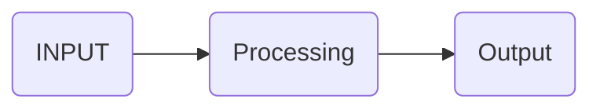

# Terminology

### Software
A program or a set of programs that fulfill desired functionality. It contains organised code written by programmers in any programming language.

### Software Engineering
Application of Engineering concepts in Software development in a systematic method.

### Software Requirement Specification
A document that contains complete information about how a software is expected to perform.

### Software Development Life Cycle
A designed process for planning, developing, testing and deploying a software.

### Requirement Analysis
- First stage in software development life cycle. 
- Determines the needs or conditions to meet for a new or altered product.
- Takes account of the possibly conflicting requirements of the various stakeholders.

**ISO 9000** is a set of international standards on quality management and quality assurance developed to help companies effectively document the quality system elements to be implemented to maintain an efficient quality system. They are not specific to any one industry and can be applied to organizations of any size.

### Dual role of Software
Software can act in two different ways:
- As a product
- As a medium to deliver product

### Program vs Software
| Program                                             | Software                                                                       |
| --------------------------------------------------- | ------------------------------------------------------------------------------ |
| Program is a set of instructions related each other | Software is a collection of program designed for specific task                 |
| Usually small in size                               | Usually large in size                                                          |
| Developed by individuals                            | Developed by large no of users                                                 |
| Lack in proper documentation                        | Proper documentation and user manual prepared                                  |
| Unplanned, usually not Systematic                   | Well Systematic, organized, planned approach                                   |
| Provide Limited functionality and less features     | Provides more functionality as they are big in size more options and features. |

# Software Engineering

Software engineering is an engineering discipline that’s applied to the development of software in a systematic approach (called a software process).It’s the application of theories, methods, and tools to design build software that meets the specifications efficiently, cost-effectively, and ensuring quality. It is not only concerned with the technical process of building a software, it also includes activities to manage the project, develop tools, methods and theories that support the software production.

Not applying software engineering methods results in more expensive, less reliable software, and it can be vital on the long term, as the changes come in, the costs will dramatically increase.

## Objectives

- Maintainability
- Correctness
- Reusability
- Testability
- Reliability
- Portability
- Adaptability

## Importance

- Reduces complexity
- To minimize software cost
- To decrease time
- Handling big projects
- Reliable software
- Effectiveness

# Software Development Life Cycle

Software Development Life Cycle (SDLC) is a process used by the software industry to design, develop and test high quality software. The SDLC aims to produce high-quality software that meets or exceeds customer expectations, reaches completion within times and cost estimates. The life cycle defines a methodology for improving the quality of software and the overall development process. It consists of a detailed plan describing how to develop, maintain, replace and alter or enhance specific software.

## Phases

### 1. Planning and Requirement Analysis

- Performed by the senior members of the team with inputs from the customer, the sales department, market surveys and domain experts in the industry.
- This information is then used to plan the basic project approach and to conduct product feasibility study in the economical, operational and technical areas. 
- Planning for the quality assurance requirements and identification of the risks associated with the project is also done in the planning stage. 
- The outcome of the technical feasibility study is to define the various technical approaches that can be followed to implement the project successfully with minimum risks.

### 2. Defining Requirements

- Clearly define and document the product requirements and get them approved from the customer or the market analysts. 
- This is done through an SRS (Software Requirement Specification) document which consists of all the product requirements to be designed and developed during the project life cycle.

### 3. Designing the Product Architecture

- SRS is the reference for product architects to come out with the best architecture for the product to be developed.
- Based on the requirements specified in SRS, usually more than one design approach for the product architecture is proposed and documented in a **DDS - Design Document Specification.**
- This DDS is reviewed by all the important stakeholders and based on various parameters as risk assessment, product robustness, design modularity, budget and time constraints, the best design approach is selected for the product.
- A design approach clearly defines all the architectural modules of the product along with its communication and data flow representation with the external and third party modules (if any).
- The internal design of all the modules of the proposed architecture should be clearly defined with the minutest of the details in DDS.

### 4. Building or Developing the Product

- The actual development starts and the product is built. The programming code is generated as per DDS during this stage.
- If the design is performed in a detailed and organized manner, code generation can be accomplished without much hassle.
- Developers must follow the coding guidelines defined by their organization and programming tools like compilers, interpreters, debuggers, etc. are used to generate the code.
- Different high level programming languages such as C, C++, Pascal, Java and PHP are used for coding. The programming language is chosen with respect to the type of software being developed.

### 5. Testing the Product

- The testing only stage of the product where product defects are reported, tracked, fixed and retested, until the product reaches the quality standards defined in the SRS.

### 6. Deployment in the Market and Maintenance

- Once the product is tested and ready to be deployed it is released formally in the appropriate market. 
- Sometimes product deployment happens in stages as per the business strategy of that organization.
- The product may first be released in a limited segment and tested in the real business environment (UAT- User acceptance testing).

# SDLC Models

## Waterfall Model

The Waterfall Model was the first Process Model to be introduced. It is also referred to as a linear-sequential life cycle model. It is very simple to understand and use. 

In a waterfall model:
- Each phase must be completed before the next phase can begin and there is no overlapping in the phases.
- Illustrates the software development process in a linear sequential flow.
- The phases do not overlap.

### Classic Waterfall Model

In Classic Waterfall model:
- No User feedback is incorporated.
- Product is made solely based on requirement analysis and definition

#### Advantages

- **Simple and Easy to Use:** The process is straightforward, with each phase following the other in a linear sequence.
- **Easy to Manage:** The rigidity of the model ensures that each phase has specific deliverables and a defined review process.
- **Phased Approach:** Each phase is processed and completed one at a time, ensuring that all aspects are addressed before moving on.
- **Well-Documented Process:** Since each phase must be completed before moving to the next, extensive documentation is created throughout the project.
- **Works Well for Small Projects:** Ideal for projects with well-understood requirements and little chance of change.

#### Disadvantages

- **Late Software Delivery:** No working software is produced until late in the development cycle, making it difficult to address issues early.
- **High Risk and Uncertainty:** The rigid structure can lead to high risk and uncertainty, especially if requirements are not well-defined from the start.
- **Not Suitable for Complex Projects:** It struggles with complex and object-oriented projects where requirements might evolve.
- **Inflexibility to Change:** Once a phase is completed, it's challenging to go back and make changes without starting over, making it unsuitable for projects with potential requirement changes.
- **Difficulty in Measuring Progress:** Progress is often difficult to measure until the later stages, as early phases don't produce tangible software.

### Iterative Waterfall Model

In Iterative waterfall model:
- Every step includes a Feedback phase, which makes sure the project doesn't go off track from User needs
- Final product is much closer to what the users want

#### Advantages

- **Feedback Loops:** Allows for feedback and revisions at each phase, reducing the risk of misunderstandings and errors.
- **Improved Flexibility:** Although still structured, the model allows for some adjustments between phases, making it more adaptable than the classic waterfall.
- **Early Detection of Issues:** Problems can be detected earlier in the process due to the possibility of revisiting previous phases.
- **Better for Complex Projects:** More suited to complex projects where requirements may evolve over time, as it allows for iteration.

#### Disadvantages

- **Increased Complexity:** The iterative approach adds complexity, as managing revisions and feedback loops requires more effort and oversight.
- **Still Risky:** While it reduces some risk, the model can still struggle with projects where requirements are highly uncertain or subject to change.
- **Documentation Overhead:** Iteration can lead to more documentation, as each phase may need to be re-documented if changes are made.
- **Longer Project Duration:** Repeating phases can extend the overall timeline of the project, especially if multiple iterations are needed.

### Applications

This model is applicable in projects where:
- Requirements are very well documented, clear and fixed.
- Product definition is stable.
- Technology is understood and is not dynamic.
- There are no ambiguous requirements.
- Ample resources with required expertise are available to support the product.
- The project is short.

## Prototype Model

Prototype Model's main principle is instead of freezing the requirements before the development, a mock prototype is build while understanding the requirements. This stage is repeated, gathering information, refining requirements and the prototype, so that after some iterations the team gets the requirements they need to start development.

A prototype is an imitation of the final product that gives similar feel of it, and helps understand what the outcome's gonna be.

### Advantages

- Users are actively involved in the development
- Since in this methodology a working model of the system is provided, the users get a better understanding of the system being developed.
- Errors can be detected much earlier.
- Quicker user feedback is available leading to better solutions.
- Missing functionality can be identified easily

### Disadvantages

- Leads to implementing and then repairing way of building systems. 
- Practically, this methodology may increase the complexity of the system as scope of the system may expand beyond original plans.
- Incomplete application may cause application not to be used as the full system was designed incomplete, or inadequate problem analysis was done.

### Applications

Prototype model should be used when the desired system needs to have a lot of interaction with the end users, e.g. Online Systems.

## Spiral Model

This model combines the idea of iterative development with the systematic and controlled aspects of Waterfall model. As you can see in the diagram, this model leads to incremental releases of the product as well as incremental refinement through each iteration around the spiral.

Spiral model has four phases:
- **Identification**: Determining the objective and gathering the requirements
- **Design**: Includes architectural, logical, physical designs and the final design.
- **Development**: Actual development of the software based on the information from previous steps.
- **Evaluation**: Identifying, estimating and monitoring the developed product. Customer feedback is essential, and every bit of information is used in the next iteration.

### Advantages

- Allows elements to be added into the software anytime
- Allows extensive use of prototypes
- Consistent method, allowing multiple builds and releases, leading to an orderly transition to maintenance activity
- Forces early user involvement, with feedback and user-centric design

### Disadvantages

- Requires very strict management
- Risk of running the spiral for infinite loop
- Complex process
- Requires extensive documentation

### Applications

Spiral model can be applied:
- When there is a budget constraint
- For medium to high risk projects
- For long-term commitment projects because of potential changes
- When customers are not sure of their requirements
- When requirements are complex and need evaluation

## Agile Software Development

A time-bound, iterative approach to software development, that builds software incrementally instead of all at once, just like the Spiral model.

**Characteristics**:
- Satisfying customer needs is HIGHEST priority, and performed through early and continuous delivery of software
- Welcomes changing requirements at any point of time in the development
- Frequently delivers software
- Lets the motivated individuals build projects by providing them with the environment and support they need

**Development Process**:
- Design and Implementation are central activities. They also include Requirements elicitation and testing
- Iteration occurs across activities, thus the requirements and the design are evaluated simultaneously
- Allocation of requirements, Design planning, and Development; these are executed in a series of increments. Hence the flexibility of the Agile development.
- Focus on Development is more than documentation.

### Advantages

- Software is deployed faster, hence increasing trust of customer
- Adapts to changing requirements faster
- Gets immediate feedback from user, which is rapidly used in software improvement
- People and Interactions are high priority than processes and tools

### Disadvantages

- Difficult to assess the effort required at early stages
- More development-focused, thus produces less documentation
- Heavily depends on customer input. So if customer has ambiguity in his vision, this can put the project off track
- In large scale projects, face to face interactions can be hard
- New programmers find it difficult to adapt to the environment

## V Model

This is a model different than the others, where process executes in a sequential manner in a V-shape, as you can see in the diagram. It is also known as *Verification and Validation model*. It associates a testing phase to each development phase, and makes it such that next phase can only be started if the testing of previous phase is completed.

The V Model has Design and Implementation phases on one side, and Validation and Verification phases on the other, connected in a V-shape. Hence the name.

### Design Phases

- **Requirements Analysis**: Detailed communication with customer to gather requirements
- **System Specification and Design**: System design; Complete hardware and communication step
- **Architectural Design**: Communication between internal modules and with other systems
- **Module Design**: Detailed design of internal modules; Low Level Design (LLD).

### Testing Phases

- **Unit Testing**: Developed during Module design. Executed to eliminate bugs at unit level
- **Integration Testing**: Developed during Architecture design. Executed to check integration between modules
- **System Testing**: Developed during System design. Executed to check the complete application.
- **User Acceptance Testing (UAT)**: Executed to check if software meets user requirements.

### Principles

- Hierarchical perspective
- Cohesion of Data and Processes
- Scalability
- Cross-Referencing between Design and Testing
- Documentation

### Advantages

- Disciplined, Rigid model; phases are completed one at a time
- Extensive defect-checking; Bugs and defects are easily found, at early stages
- Simple and easy to understand
- Error-free and good quality output
- Accurate progress tracking

### Disadvantages

- High risk and uncertainty
- Not good for complex and Object-oriented projects
- Not for projects where requirements are not clear, or can change
- No iteration of phases

### Applications

V Model can be used where:
- Requirements are well defined, and are not subject to change
- Ample technical resources are available with expertise in them
- Projects are small

# Requirement Analysis

This is a significant and essential step, where we analyse and refine the gathered requirements to make consistent and unambiguous requirements. Completion of this step vastly increases understanding of the project. Customer interaction may also be included to clarify points of confusion.

Steps of Requirement Analysis include:
1. **Draw Context Diagram**: A simple model that defines the boundaries and interfaces of the system with the external world.

    Example: ATM system

2. **Development of Prototype** (Optional): With use of the information gathered from context diagram and requirements, a Prototype can be made to imitate the final product for the clients to get a feel of it and provide further feedback. This helps in increasing the understanding of the requirements.

3. **Model the requirements**: This step includes visualizing the different functions, entities and relationships between them. Models like Data Flow Diagrams, ER Diagrams etc. are used.

4. **Finalizing**: As we make graphical models, we obtain clearer understanding of the project. Thus the last step is to use all the knowledge we obtain and finalize the requirements and document them.

## Analysis Principle

Investigators have identified analysis problems and their causes and have developed a variety of notations and corresponding sets of heuristics to overcome them. Each analysis method has a unique point of view.

- The information domain of a problem must be represented and understood.
- The functions that the software is to perform must be defined.
- The behavior of the software must be represented.
- The models that depict information, function, and
- The models that depict information function and behavior must be partitioned in a manner that uncovers details in a layered fashion.
- The analysis process should move from essential information toward implementation detail.

In addition to these operational analysis principles for requirements engineering:

- Understand the problem before you begin to create the analysis model.
- Develop prototype that enable a user to understand how human/machine interaction will occur.
- Record the origin of and the reason for every requirement.
- Use multiple views of requirements.
- Rank requirements.
- Work to eliminate ambiguity

## Software Prototyping

Prototyping is the development of a preliminary version of a software system (a prototype) in order to allow certain aspects of that system to be investigated. Often the primary purpose of a prototype is to obtain feedback from the intended users; the requirements specification for the system can then be updated to reflect this feedback, and so increase confidence in the final system. Additionally (or alternatively) a prototype can be used to investigate particular problem areas, or certain implications of alternative design or implementation decisions.

The intention with a prototype is normally to obtain the required information as rapidly as possible and with the minimum investment of resources, and it is therefore common to concentrate on certain aspects of the intended system and completely ignore others. A prototype may for example be developed with no concern for its efficiency or performance, and certain functions of the final system may be entirely omitted. It must however be realistic in those aspects specifically under investigation.

## Software Requirement Specification (SRS)

A **software requirements specification** (SRS) is a detailed description of a software system to be developed with its functional and non-functional requirements. The SRS is developed based on the agreement between customer and contractors. 

A good SRS defines the how Software System will interact with all internal modules, hardware, communication with other programs and human user interactions with wide range of real life scenarios. Using the SRS document on QA lead, managers create test plan. It is very important that testers must be cleared with every detail specified in this document in order to avoid faults in test cases and its expected results.

### Rules

1. **Correctness of SRS should be checked**

2. **Ambiguity should be avoided.**
	Some words have more than one meaning which might confuse testers making it difficult to get the exact reference.

3. **Requirements should be complete.**
	What exactly is required from the application is the first thing which needs to be clear.

4. **Consistent requirements.**
	SRS should be consistent within itself and to its reference documents.

5. **Verification of expected result:**
	SRS should clearly state what is expected.

6. **Testing environment:**
	SRS should have clear documentation on what type of environment is needed to set up.

7. **Pre-conditions defined clearly:** 
	In SRS, all the pre-conditions should be mentioned clearly.

8. **Requirements ID:**
	Requirements IDs make it easy to categorize modules so just by looking at them, tester will know which module to refer.

9. **Security and Performance criteria:**
	Security is priority when a software is tested especially when it is built in such a way that it contains some crucial information when leaked can cause harm to business. And performance plays a very important role in business so all the requirements related to performance must be clear to the tester and he must also know when and how much stress or load testing should be done to test the performance.

10. **Assumption should be avoided:**
    It is better to avoid assumptions and ask clients about all the “missing requirements” to have a better understanding of expected results.

11. **Deletion of irrelevant requirements:**
	Based on the understanding of the software, it needs to be decided which are irrelevant requirements and get removed to avoid confusions and reduce work load.

12. **Freeze requirements:**
	Freezing means that the result will not change again until and unless some major addition or modification is introduced in the software.

### Properties

- **Concise**
- **Well-Structured**
- **Black-box view**
	It should only define what the system should do and refrain from stating how to do these.
- **Conceptual integrity**
	It should show conceptual integrity so that the reader can merely understand it.
- **Verifiable:**
	All requirements of the system, as documented in the SRS document, should be correct. 

## Data Modelling Approaches

Typically, a data model can be thought of as a flowchart that illustrates the relationships among data. It enables stakeholders to identify errors and make changes before any programming code has been written.

**Steps:**
- Understand your application workflow
- Model the queries required by the application
- Design the tables
- Determine primary keys
- Use the right data types effectively

**Pros:**
- Lowers cost of development with a graphical view of the data model, thus spending less time and money on coding
- Better management of data as a resource with preliminary data modelling and understanding the best approach
- Accurate representation of objects by creating diagrams and flows
- Better performance by ensuring best approach at time of data modelling

**Cons:**
- To do Data modelling, nature of physical data is needed to be known
- Even a minor change in the structure later will lead to change in entire structure

### Functional Data Modelling

In this type of data modelling, a simple flow is followed:

Types of Functional Data Models:
- Data Flow Diagram (DFD)
- Entity Relationship Diagram (ER Diagram)

### Behavioral Data Modelling

This model represents the interaction among the structural diagrams. It shows the dynamic nature of the system.

Types of Behavioral Data Models:
- State Machine Diagrams
- Activity Diagrams
- Use Case Diagrams
- Sequence Diagram
- Communication Diagram
- Timing Diagram
- Interaction Overview Diagram

### Structural Data Modelling

This model captures the static features of the system. It basically represents the framework of the system, where all other components exist.

Types of Structural Data Models:
1. Class Diagram
2. Composite Structure Diagram
3. Object Diagram
4. Component Diagram
5. Deployment Diagram
6. Package Diagram

#### Data Dictionary

A data dictionary is a file or a set of files that includes a database's metadata. It is an essential component of any relational database. Ironically, because of its importance, it is invisible to most database users. Typically, only database administrators interact with the data dictionary.

The data dictionary generally includes information about the following:
- Name of the data item
- Aliases
- Description/purpose
- Related data items
- Range of values
- Data structure definition/Forms

## Data Model Diagrams

### Data Flow Diagram (DFD)

The following are the components of a DFD:

**Example:** DFD of a Bookstore

### Structured Charts

Structured Chart is a graphical representation which shows:
- System partitions into modules
- Hierarchy of component modules
- The relation between processing modules
- Interaction between modules
- Information passed between modules

**Components Used**:
- *Rectangle*- Module
- *Curved Rectangle*- Database
- *Arrow with hollow start*- Data flow
- *Arrow with filled start*- Control flow
- *Loop Arrow*- Loop in module
- *Diamond*- Conditional call

**Example:**

### Object-Oriented Design

1. **Objects**: Entities are denoted as Objects.

2. **Classes**: Entities are categorized and generalized into Classes. So classes can have objects.

3. **Messages**: Objects communicate by message passing. Messages are often implemented as procedure or function calls.

4. **Abstraction**: Abstraction is the removal of the irrelevant and the amplification of the essentials.

5. **Encapsulation**: Encapsulation not only bundles essential information of an object together but also restricts access to the data and methods from the outside world.

6. **Inheritance**: Multiple classes can stack up in a hierarchical manner, like a parent-child relationship.

7. **Polymorphism**: Methods of the same name differ in input or functionality. 

### Unified Modeling Language (UML)

UML is not a programming language, it is rather a visual language. We use UML diagrams to portray the behavior and structure of a system. UML helps software engineers, businessmen and system architects with modelling, design and analysis.

The main aim of UML is to define a standard way to visualize the way a system has been designed. It is quite similar to blueprints used in other fields of engineering.

UML is linked with object oriented design and analysis. UML makes the use of elements and forms associations between them to form diagrams. Diagrams in UML can be broadly classified as:

- **Structural Diagrams** – Capture static aspects or structure of a system. Structural Diagrams include: Component Diagrams, Object Diagrams, Class Diagrams and Deployment Diagrams.

- **Behavior Diagrams** – Capture dynamic aspects or behavior of the system. Behavior diagrams include: Use Case Diagrams, State Diagrams, Activity Diagrams and Interaction Diagrams.

Here's an example for a **Class Diagram**

Here's an example for an **Object Diagram**

### Use Case Diagram

Use case diagrams are used to gather the requirements of a system including internal and external influences. These requirements are mostly design requirements. Hence, when a system is analyzed to gather its functionalities, use cases are prepared and actors are identified.

Actors can be defined as something that interacts with the system. Actors can be a human user, some internal applications, or may be some external applications.

Example:

### Activity Diagram

